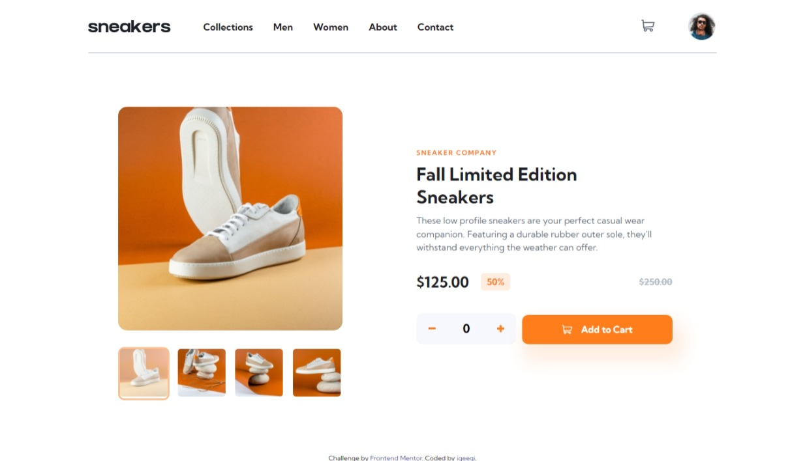

# Frontend Mentor - E-commerce product page solution

This is a solution to the [E-commerce product page challenge on Frontend Mentor](https://www.frontendmentor.io/challenges/ecommerce-product-page-UPsZ9MJp6). Frontend Mentor challenges help you improve your coding skills by building realistic projects.

## Table of contents

- [Overview](#overview)
  - [The challenge](#the-challenge)
  - [Screenshot](#screenshot)
  - [Links](#links)
- [My process](#my-process)
  - [Built with](#built-with)
  - [What I learned](#what-i-learned)
  - [Useful resources](#useful-resources)
- [Author](#author)

## Overview

### The challenge

Users should be able to:

- View the optimal layout for the site depending on their device's screen size
- See hover states for all interactive elements on the page
- Open a lightbox gallery by clicking on the large product image
- Switch the large product image by clicking on the small thumbnail images
- Add items to the cart
- View the cart and remove items from it

### Screenshot

[Desktop Cart Preview](./screenshot/desktop-cart-preview.jpeg)
[Desktop Lightbox Preview](./screenshot/desktop-lightbox.jpeg)
[Mobile Preview](./screenshot/mobile-preview.jpeg)
[Mobile Cart Preview](./screenshot/mobile-cart-preview.jpeg)
[Mobile Menu Preview](./screenshot/mobile-menu-preview.jpeg)

### Links

- Solution URL: [E-commerce product page Solution](https://www.frontendmentor.io/solutions/ecommerce-product-page-challenge-on-frontend-mentor-30Uz9yScU)
- Live Site URL: [E-commerce product page challenge](https://eginugrahas-ecommerce-product.netlify.app/)

## My process

### Built with

- HTML5
- CSS
- JavaScript
- Sass

### What I learned

I learned about how to make lightbox and a lot about Javascript 

### Useful resources

- [E-Commerce Product Page with HTML & CSS | Frontendmentor Challenge by MRZ.Code.Manufacture](https://www.youtube.com/watch?v=Vjyxlq1hrME&t=810s&ab_channel=MRZ.Code.Manufacture) - This helped me when i got stuck and be my first source.

## Author

- Website - [Egi Nugraha S](https://igeegi.my.id)
- Frontend Mentor - [@eginugrahas](https://www.frontendmentor.io/profile/eginugrahas)
- Instagram - [@eginugrahas](https://www.instagram.com/eginugrahas)
- LinkedIn - [@eginugrahas](https://www.linkedin.com/eginugrahas)

